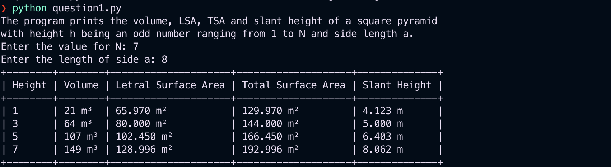

# Saint Mary’s Home Tasks

## How to run the code

To run this code, you have two options: clone the repository or use a Colab Notebook.

### Clone and run the repository

- Clone the repository in your local machine
    
    ```bash
    git clone https://github.com/salman299/take-home-test.git
    ```
    
- Go inside `take-home-test` directory
- Create and Activate a Python virtual environment ( [link](https://docs.python.org/3/library/venv.html) )
- Install requirements using this command
    
    ```bash
    pip install -r requirements.txt
    ```
    
- Run scripts using these commands
    
    ```bash
    # To run the first question
    python question1.py
    
    # To run the second question
    python question2.py
    
    # To run the third question
    python question3.py
    ```
    

### Google Colab Notebook

- Go to the Colab repository ( [link](https://colab.research.google.com/drive/1J8_UN82PIAruJXKAPcXbubxBXfC0II5h?usp=sharing) ) or import `Saint_Mary's_Questions.ipynb` inside a Colab notebook.
- Execute code snippets one by one, all details of the questions are present in the notebook.

## Outputs

### Question 1:

**Test Case 1**



**Test Case 2**


### Question 2:

**Test Case 1**


**Test Case 2**


### Question 3:

Using SQL perform the below functions on the following table showing a list of products sold.

| Product Name | Category Id | Category | Year | Quantity Purchased |
| --- | --- | --- | --- | --- |
| Shampoo | 006 | Health and beauty | 2020 | 10070 |
| Bowl | 005 | Home and lifestyle | 2021 | 210 |
| Potato | 002 | Produce | 2021 | 30130 |
| Protein Powder | 001 | Sports and travel | 2022 | 400 |
| Energy Drink | 001 | Sports and travel | 2020 | 834 |
| Light Bulbs | 005 | Home and lifestyle | 2022 | 900 |
| Baking Powder | 004 | Baking | 2020 | 5000 |
| Skimmed Milk | 003 | Dairy | 2021 | 300000 |
| Yogurt | 003 | Dairy | 2020 | 98700 |
| Cake Mix | 004 | Baking | 2020 | 720 |
| Lotion | 006 | Health and beauty | 2020 | 100 |
| Grapes | 002 | Produce | 2020 | 59000 |
| Hand Soap | 006 | Health and beauty | 2021 | 89211 |
| Flour | 004 | Baking | 2021 | 39091 |
| Brownie Mix | 004 | Baking | 2021 | 2131 |
| Tomato | 002 | Produce | 2021 | 653 |

**There are functional dependencies in this table, so first, normalise the relation/table to the second normal form (2NF). Please show the resulting table(s) after the normalization.**

---

**Solution**

To achieve 2NF, we need to ensure that all non-prime attributes are fully functionally dependent on the entire primary key.

To normalize to 2NF, we'll create two tables:

Table 1: Category

- Primary Key: CategoryId
- Attributes: CategoryId, Category

Table 2: ProductSold

- Primary Key: {ProductName, Year}
- Attributes: ProductName, Year, CategoryId, QuantityPurchased

**Results:**

**Table 1: Category**

| Category Id | Category |
| --- | --- |
| 006 | Health and beauty |
| 005 | Home and lifestyle |
| 002 | Produce |
| 001 | Sports and travel |
| 004 | Baking |
| 003 | Dairy |

**Table 2: ProductSold**

| Product Name | Year | Category Id | Quantity Purchased |
| --- | --- | --- | --- |
| Shampoo | 2020 | 006 | 10070 |
| Bowl | 2021 | 005 | 210 |
| Potato | 2021 | 002 | 30130 |
| Protein Powder | 2022 | 001 | 400 |
| Energy Drink | 2020 | 001 | 834 |
| Light Bulbs | 2022 | 005 | 900 |
| Baking Powder | 2020 | 004 | 5000 |
| Skimmed Milk | 2021 | 003 | 300000 |
| Yogurt | 2020 | 003 | 98700 |
| Cake Mix | 2020 | 004 | 720 |
| Lotion | 2020 | 006 | 100 |
| Grapes | 2020 | 002 | 59000 |
| Hand Soap | 2021 | 006 | 89211 |
| Flour | 2021 | 004 | 39091 |
| Brownie Mix | 2021 | 004 | 2131 |
| Tomato | 2021 | 002 | 653 |

**Using the table(s) in 2NF, write a query to display the total quantity purchased per year for each category, sorted by category and year.**

---

**Solution**

**Query:**

```sql
SELECT c.CategoryId as Category_Id, c.Category AS Category, p.Year AS Year, SUM(p.QuantityPurchased) AS TotalQuantityPurchased
FROM ProductSold p
JOIN Category c ON p.CategoryId = c.CategoryId
GROUP BY c.Category, p.Year
ORDER BY c.Category, p.Year;
```

**Output**


